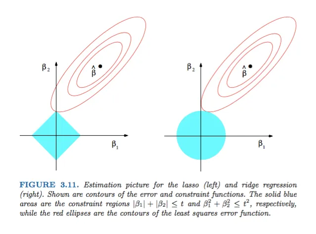

# Регуляризации
Да, вы правильно поняла, схуя-то отдельная функция регуляризации это отдельная модель

## Lasso / L1 
### Абстрактно / Магия
`Linear Regression` считает "правильные" значения коэффициентов одной заумной формулой. Этой заумной формулы стало мало, т.к. в нашем мире много дисперсии (разброса) и нету конкретной линейной зависимости. 

`Lasso` же по сути даже не формула, а алгоритм.

В результате его применения:
- Некоторые веса отметаются нахуй (становятся равны нулю)
- Модель автоматически выбирает признаки

Когда полезно:
- Когда признаков дохуя
- Есть подозреннице на то что некоторые из них нахуй не нужны

### Под капотом
Помимо нашей обычной формулы средней квадратической ошибки $\rm{MSE}$ мы просто добавляем формулу

$\lambda \sum_{i=1}^{m}{|w_i|}$

И конечной формулой будет 

$\rm{Cost} = \frac{1}{n}\sum_{i=1}^{n}(\hat{y_i} - y_i)^2 +\lambda \sum_{i=1}^{m}{|w_i|}$

Где 
- $m$ - Количество признаков
- $n$ - Количество рядов
- $y$ - Наш предикт таргета
- $\hat{y_i}$ - Таргет
- `alpha` ( $\lambda$ (лямбда) ) - Регуляризационный параметр который контролирует силу регуляризации 
- $w_i$ - Коэффициенты признаков (веса)

Геометрически это поиск точки касания. (Координаты её - наши идеальный веса) 
Возьмём двумерное пространство (если у нас будет всего 2 признака):

- У нас есть $MSE$ которая выглядит как овал
- У нас есть сумма модулей $|w_1|+|w_2|$

Модуль - это галочка, сумма двух модулей - это ромб. MSE - овал (эллипс)
Но как нам найти производную модуля? Никак. Поэтому под капотом используется координатный спуск. Я ебал это объяснять если честно. Если очень вкратце и упрощённо: всё "легко" в случае если у нас 2ух мерное измерение: ромб и овал. А в случае много миллиардного измерения у нас выйдет гипероктаэдр и гиперэллипсоид (лучше и не знать что это) - клякса и бриллиант. Координатный спуск - берёт отдельно каждый признак (остальные замараживает) и двигает их пытаясь минимизировать ошибку. 

**ЛЕВЫЙ** РИСУНОК

Идея в том чтобы штрафовать сумму модулей весов. И да, какие-то веса могут уйти вообще.

Мы можем регулировать силу влиянии такой регуляризации с помощью `alpha`

### Что надо знать всем

**ВАЖНАЯ ЕБАТОРИЯ С ТЕРМИНОЛОГИЕЙ**

| Библиотека | Параметр в коде | Математический символ |
| :--- | :--- | :--- |
| **scikit-learn** | `alpha` | $\lambda$ |
| **R (glmnet)** | `lambda` | $\lambda$ |
| **XGBoost** | `reg_alpha` | $\alpha$ |

Что будет если менять параметр `alpha`
| Значение `alpha` | Влияние на модель | Математический эффект |
| :--- | :--- | :--- |
| `alpha = 0` | Обычный МНК (OLS) | Нет штрафа |
| `alpha > 0` | Отбор признаков | Зануляет веса ($w_i = 0$) |
| `alpha` $\to \infty$ | Все веса зануляются | Модель — константа |

Модель:
- Некоторые веса отметаются нахуй (становятся равны нулю)
- Автоматически выбирает признаки

Когда полезно:
- Когда признаков дохуя
- Есть подозреннице на то что некоторые из них нахуй не нужны

## Ridge / L2
### Абстрактно / Магия
`Linear Regression` считает "правильные" значения коэффициентов одной заумной формулой. Этой заумной формулы стало мало, т.к. в нашем мире много дисперсии (разброса) и нету конкретной линейной зависимости. 

`Ridge` же по сути это ещё более заумная формула. Она штрафует за большие веса

В результате её применения:
- Веса уменьшаются, но никогда не обнуляются
- Модель меньше выебываеться (становится более стабильной)
- Хорошо работает при **мультиколлинеарности**

"Можно использовать все признаки, но аккуратно - не выебываясь (не размахивая весами)"

### Под капотом
Помимо нашей обычной формулы средней квадратической ошибки $\rm{MSE}$ мы просто добавляем формулу

$\lambda \sum_{i=1}^{m}{w_i^2}$

И конечной формулой будет 

$\rm{Cost} = \frac{1}{n}\sum_{i=1}^{n}(\hat{y_i} -y_i)^2 + \lambda \sum_{i=1}^{m}{w_i^2}$

Где
- $m$ - Количество признаков
- $n$ - Количество рядов
- $y$ - Наш предикт таргета
- $\hat{y_i}$ - Таргет
- `alpha` ( $\lambda$ (лямбда) ) - Регуляризационный параметр который контролирует силу регуляризации 
- $w_i$ - Коэффициенты признаков (веса)

Геометрически это поиск точки касания. (Координаты её - наши идеальный веса) 
Возьмём двумерное пространство (если у нас будет всего 2 признака):

- У нас есть $MSE$ которая выглядит как овал
- У нас есть сумма квадратов $w_1^2+w_2^2$

Сумма квадратов - это круг, сумма двух модулей - это ромб. MSE - овал (эллипс)

И как же найти "идельные" веса с минимальной ошибкой? (В идеале, ошибка = 0, конечно)

Чтобы найти "идеальные" веса (где ошибка минимальна), мы используем аналитическое решение. Поскольку график $\mathrm{MSE}$ — это выпуклая "чаша" (овал (в 2D)) и нужно и веса не раздувать - мы ищем компромисс. Мы добавляем к $\mathrm{MSE}$ штраф $aw^2$. На графике это выглядит так, будто мы "сжимаем" нашу чашу со всех сторон к центру $(0,0)$. Дно новой чаши смещается ближе к нулю, а сама она становится более крутой. Мы точно так же (как в `Linear Regression`) берем производную новой функции и приравниваем к нулю, чтобы найти новое, устойчивое положение весов.

**ПРАВЫЙ** РИСУНОК

<!-- 1. **Раскрываем нормы** через транспонирование векторов:
$$Q(w) = (Xw - y)^T(Xw - y) + \alpha w^T w$$

2. **Берем производную** (градиент) функции по вектору весов $w$:
$$\frac{\partial Q}{\partial w} = 2X^T(Xw - y) + 2\alpha w$$

3. **Приравниваем производную к нулю**, чтобы найти точку минимума ("дно" чаши):
$$2X^T X w - 2X^T y + 2\alpha w = 0$$

4. **Группируем слагаемые с $w$**. Чтобы сложить матрицу $X^T X$ с числом $\alpha$, добавляем единичную матрицу $I$:
$$(X^T X + \alpha I) w = X^T y$$

5. **Выражаем итоговый вектор весов $w$**, умножая обе части на обратную матрицу:
$$w = (X^T X + \alpha I)^{-1} X^T y$$ -->
Из этого уравнения мы выражаем оптимальный вектор весов $w$.

Ебаторию которую не надо читать

$$
\begin{aligned}
Q(w) = \|Xw - y\|^2 + \alpha \|w\|^2 \\
\frac{\partial Q(w)}{\partial w} = 2X^T(Xw - y) + 2\alpha w = 0 \\
2X^TXw - 2X^Ty + 2\alpha w = 0 \\
X^TXw + \alpha Iw = X^Ty \\
(X^TX + \alpha I)w = X^Ty \\
w = (X^TX + \alpha I)^{-1} X^Ty
\end{aligned}
$$

В общем наша формула весов будет

$w = (X^TX + \alpha I)^{-1} X^Ty$

<!-- Идея в том чтобы штрафовать сумму модулей весов. И да, какие-то веса могут уйти вообще.
НЕ ЗАБЫТЬ ПОМЕЯНТЬ, ЭТО К l1
Мы можем регулировать силу влиянии такой регуляризации с помощью `alpha` -->

### Что надо знать всем

**ВАЖНАЯ ЕБАТОРИЯ С ТЕРМИНОЛОГИЕЙ**
| Библиотека | Параметр в коде | Математический символ |
| :--- | :--- | :--- |
| **scikit-learn** | `alpha` | $\lambda$ |
| **R (glmnet)** | `lambda` | $\lambda$ |
| **XGBoost** | `reg_lambda` | $\lambda$ |
| **PyTorch / TF** | `weight_decay` | $\lambda$ |

Что будет если менять параметр `alpha`

| Значение `alpha` | Влияние на модель | Математический эффект |
| :--- | :--- | :--- |
| `alpha = 0` | Обычный МНК (OLS) | Нет штрафа |
| `alpha > 0` | Уменьшение сложности | Веса стремятся к 0 ($w_i \to 0$) |
| `alpha` $\to \infty$ | Веса близки к нулю | Минимум дисперсии |

Модель:
- Веса уменьшаются, но никогда не обнуляются
- Не выебываеться (становиться стабильней)

Когда полезно:
- При мультиколлинеарности
- Есть подозреннице на то что некоторые веса всё таки незаметно влияют

## Elastic net / L1 + L2 
### Абстрактно / Магия

### Под капотом
Помимо нашей обычной формулы средней квадратической ошибки $\rm{MSE}$ мы просто добавляем формулу

$\lambda ( (1-\alpha) \sum_{i=1}^{m}{|w_i|} + \alpha\sum_{i=1}^{m}{w_i^2})$

И конечной формулой будет

$\rm{Cost} = \frac{1}{n}\sum_{i=1}^{n}(\hat{y_i} - y_i)^2 + \lambda\left((1-\alpha)\sum_{i=1}^{m}{|w_i|} + \alpha \sum_{i=1}^{m}{w_i^2}\right)$

Где
- $m$ - Количество признаков
- $n$ - Количество рядов
- $y$ - Наш предикт таргета
- $\hat{y_i}$ - Таргет
- `alpha` ( $\lambda$ (лямбда) ) - Регуляризационный параметр который контролирует силу регуляризации 
- $w_i$ - Коэффициенты признаков (веса)
- `l1_ratio` ($\alpha$) -коэффициент смешивания.

### Что надо знать всем 

**ВАЖНАЯ ЕБАТОРИЯ С ТЕРМИНОЛОГИЕЙ**

| Библиотека | Сила штрафа ($\lambda$) | Пропорция (L1 vs L2) |
| :--- | :--- | :--- |
| **scikit-learn** | `alpha` | `l1_ratio` |
| **R (glmnet)** | `lambda` | `alpha` |
| **XGBoost** | `reg_alpha` + `reg_lambda` | (задаются раздельно) |
Что будет если менять параметр `l1_ratio`
### ElasticNet (L1 + L2)
| Значение `l1_ratio` | Тип регуляризации | Формула штрафа |
| :--- | :--- | :--- |
| `l1_ratio = 1` | Чистый Lasso | $\alpha \cdot ||w||_1$ |
| `l1_ratio = 0` | Чистый Ridge | $\frac{1}{2} \alpha \cdot ||w||^2_2$ |
| `0 < l1_ratio < 1` | Смешанный тип | $\alpha \rho L1 + \frac{1}{2} \alpha (1-\rho) L2$ |
